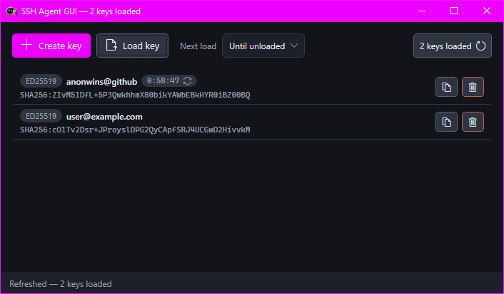

# SSH Agent GUI

A small Windows app that gives you a visual front end for the OpenSSH authentication agent. Create keys, load them into the agent, copy public keys, and unload when you are done — without living in a terminal.

Built for developers who use Git, SSH, and WSL on Windows and want something closer to what macOS or Linux desktop tools offer.



## Features

- **Manage keys in one place** — see what is loaded, load new keys, unload selected keys, or unload all
- **Create keys** — Ed25519 or RSA 4096, with an optional passphrase
- **Passphrase prompts in the app** — no console window when unlocking a key
- **Copy public keys** — grab the `.pub` text for GitHub, servers, or anywhere else
- **Drag and drop** — drop a private key file onto the window to load it
- **Auto-unload timers** — set a lifetime per key or a default for the next load (30 min, 1 hour, 8 hours, or Off)
- **System tray** — minimize to the tray and keep the app running in the background
- **Single instance** — launching again brings the existing window forward
- **Pageant bridge** — PuTTY, WinSCP (Pageant mode), Plink, and TortoiseGit can use keys loaded here while the app is running. Every signature asks Allow or Deny.

## Requirements

- Windows 10 or 11
- [OpenSSH Client](https://learn.microsoft.com/en-us/windows-server/administration/openssh/openssh_install_firstuse) installed
- The `ssh-agent` Windows service available (Manual start is fine)

## Getting started

There are no published releases yet. Build from source:

```bat
dotnet test SshAgentGui.sln
dotnet build SshAgentGui.sln -c Release
```

Run:

```bat
src\SshAgentGui\bin\Release\net9.0-windows\SshAgentGui.exe
```

Use the built `.exe` directly. Do not run the app with `dotnet run` if you need passphrase unlocking to work — OpenSSH invokes the app as an askpass helper, and that path expects a real executable.

On first run, if `ssh-agent` is stopped, the app can start it for you. Windows may ask for elevation. If the service is disabled, enable it in Services first.

## Usage

| Action | How |
| --- | --- |
| Create a key | **Create key**, or `Ctrl+N` |
| Load a key | **Load key**, drag a file onto the window, or `Ctrl+O` |
| Unload a key | Select it and press `Delete`, or use the unload action in the list |
| Copy a public key | Use **Copy public key** on a loaded or saved key |
| Refresh the list | `F5` |
| Hide the window | `Escape` (app stays in the tray) |

When you close the window or choose **Exit** from the tray, you can leave keys loaded, unload them first, or cancel.

Settings are stored under `%AppData%\SshAgentGui\`.

## Development

- .NET 9
- WPF UI
- Tests: `dotnet test SshAgentGui.sln`

The app uses the Windows OpenSSH binaries under `%SystemRoot%\System32\OpenSSH\` (with a fallback to `%ProgramFiles%\OpenSSH`), not whatever happens to be on `PATH`.

## Notes

**Auto-unload** is enforced by this app while it is running. Windows `ssh-agent` does not honor `ssh-add -t` lifetimes, so the GUI unloads keys on a timer instead. The toolbar **Auto-unload** combo sets the default for the next key you load; change a loaded key from its countdown in the list. If you fully quit the app, keys stay loaded. The same applies after a crash, sleep, or if another tool reloads a key.

**Passphrases** are kept in memory only for the unlock flow and are passed to OpenSSH over a short-lived named pipe. They are not written to disk.

**Pageant:** while the app is running it hosts the classic Pageant window and the Pageant named pipe, and forwards requests to Windows `ssh-agent`. WinSCP needs that pipe to list keys when no `.ppk` is configured; a configured `.ppk` can still sign over the older window path. Allow/Deny names the calling program when Windows can tell — that is not a proof of identity. Close PuTTY Pageant first if it is already running, or the bridge will not start. OpenSSH `ssh` and Git for Windows talk to the Windows agent directly and will not show the Allow/Deny prompt. Do not run this app as Administrator — unelevated PuTTY cannot send messages to an elevated window.

**Trust boundary:** the app runs Windows OpenSSH tools from fixed install locations. It does not verify binary signatures. Treat your OpenSSH installation as part of your system trust model.
